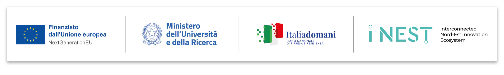

>Programma iNEST Codice ECS00000043 finanziato sui fondi PNRR MUR – M4C2” – Investimento 1.5. Avviso “Ecosistemi dell’Innovazione” 
>CUP progetto B33D24000100004

# MQTT Mosquitto message sign plugin

This plugin enhances data integrity by appending a cryptographic signature to the payload of device packets. The signature is generated at runtime by the broker and published on a PostgresQL database.

## Building

To compile the project first install the dependencies and then run the following commands:

```bash
mkdir build && cd build
cmake ..
make
```

Then you can install the library in the `/usr/local/lib` path with the command:

```bash
sudo make install
```

## License

This project is licensed under the Apache License 2.0 - see [LICENSE](LICENSE) file for details.
